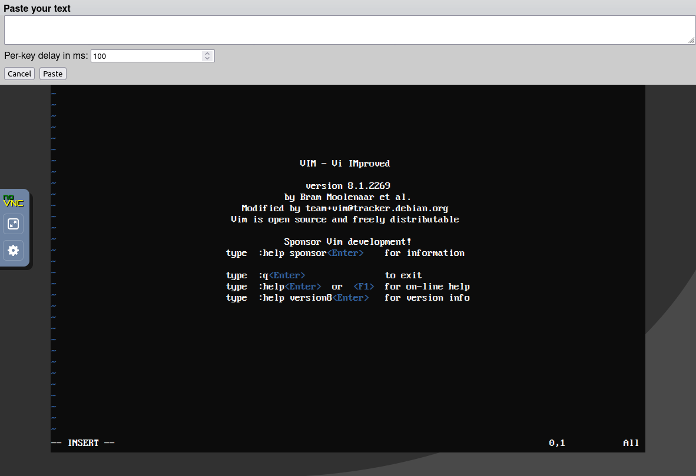
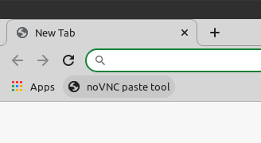
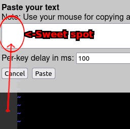

## noVNC pasting tool

Scriptlet used to paste text into noNVC windows using the browser's dev console.



This tools works by taking text you paste, and typing that text into a console.
It doesn't support anything fancy and will only work with characters that can
be typed with a keyboard.

## Usage
You may use this tool two different ways:
* Paste the code into your browser dev tools console each time it's needed, or:
* Save this tool as a bookmarkable button (a.k.a. bookmarklet), and click that
  button to show the paste tool whenever it's needed.

#### One-off use
* Right click the grey gutters on the side of your noVNC page.
* Click `Inspect`.
* Click the `Console` tab.
* Open [paste-tool.js](paste-tool.js) in this repo, and copy its contents into
  the `Console` tab. Press enter.
* The paste tool window shows up.

#### Saving as a bookmarklet
You may turn this into an easy-to-click button by saving the actual JavaScript
as a bookmark:
* In your browser, enable your bookmarks bar.
* Open [bookmarklet.js](bookmarklet.js) and copy its contents.
* Right click your bookmarks bar, click `Add page...` (Chrome) or
  `Add Bookmark...` (Firefox).
  * In the `Name` field, enter `noVNC paste tool` (or any other name you want).
  * In the `URL` field, paste the contents of `bookmarklet.js`.
  * Click `Save`.

You should now have a button that can be clicked any time to show the paste tool:



#### Pasting text
Do not use `Ctrl+V`. The KVM console steals input, and the quickest way to
prevent catastrophic problems was to outright disable all input while the text
box is selected. Instead, use the mouse.

Note that, the KVM console *also* steals mouse input if you right click while
the mouse is over the VM screen. Instead, make sure your mouse is over the grey
area when right clicking inside the text box. You might need to resize your
window to see the grey gutters.



## Notes and caveats

#### Stopping a paste
You may notice pastes are slow. This is by design (see per-key delay below).
The script currently does not have a stop button; close the KVM tab to stop a
paste tab. This will stop all JS on the page, including the paste.

#### VIM
When pasting into vim, note that some setups will do perform unwanted actions
(such as auto-indenting when enter is pressed). The solution for vim is first
to run:
```
:set paste
```
This will change `-- INSERT --` to `-- INSERT (paste) --` and yield better
results.

#### Per-key delay
This value exists because pasting too fast causes the console to receive text
out of order. 100 is conservative, you may want to increase this value on very
slow connections.

#### Ignored characters
`\r` is completely ignored. `\n` is used instead because all (modern) systems
use it in text files. The KVM console expects an actual keyboard key though, so
`\n` is converted into an enter key signal before it's sent to the console.

Note also that, because the console expects a keyboard button, things like `!`
do not actually exist. This script will, in this exact example, instead hold
`Shift` and then press `1`. I'm unsure at this stage if that will cause
internationalisation problems.
